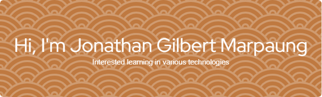

# About Me
Hi there! I'm a passionate coder and tech enthusiast, currently beginning my undergraduate journey at Telkom University. I recently graduated from high school, where I developed a strong interest in programming and exploring various aspects of technology.

During my school years, I had the honor of representing my region in the National Science Olympiad (OSN) in Informatics:
- 🥇 1st Place – OSN (Regency Level), Informatics – 2024
- 🏅 Winner – OSN (Regency Level), Informatics – 2023

These achievements fueled my drive to learn more.

### Socials
 

### Tech Stack
             

<picture>
  <source media="(prefers-color-scheme: dark)" srcset="https://raw.githubusercontent.com/jonathanmarpaung/jonathanmarpaung/output/pacman-contribution-graph-dark.svg">
  <source media="(prefers-color-scheme: light)" srcset="https://raw.githubusercontent.com/jonathanmarpaung/jonathanmarpaung/output/pacman-contribution-graph.svg">
  
</picture>
